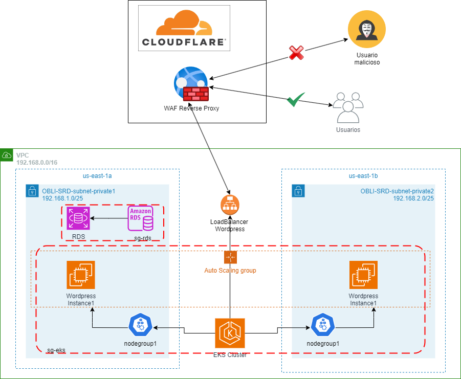

# Obligatorio-Seguridad-Redes-y-Datos
Obligatorio Seguridad en Redes y Datos - Semestre 6 2023
---
## Integrantes
- Alexander Delamar (272946)
- Martin Torres (273693)

## Despliegue de infraestructura
Se despliega la siguiente infraestructura mediante terraform:

* EKS (Cluster, Worker Group, Contenedor WordPress)
* RDS (Instancia con base de datos)
* VPC (Subnets, Gateway, RT)

## Pasos para desplegar correctamente la infraestructura
* Primero debemos asegurarnos que el archivo valores.tfvars contenga las credenciales de nuestra cuenta de AWS, para ello debemos modificar las variables llamadas "regionProvider" y "perfil" acorde a las nuestras.

* Ejecutar comando "terraform init": Este comando inicializara el directorio de trabajo de Terraform. 

* Ejecutar comando "terraform apply" o "terraform apply -auto-approve": Este comando aplica los cambios planificados en la infraestructura de AWS. Terraform creará, actualizará o eliminará los recursos según lo definido en los archivos de configuración.

## Diagrama final de nuestra infraestructura

## Demostración de la web una vez hecho los pasos del documento del obligatorio
